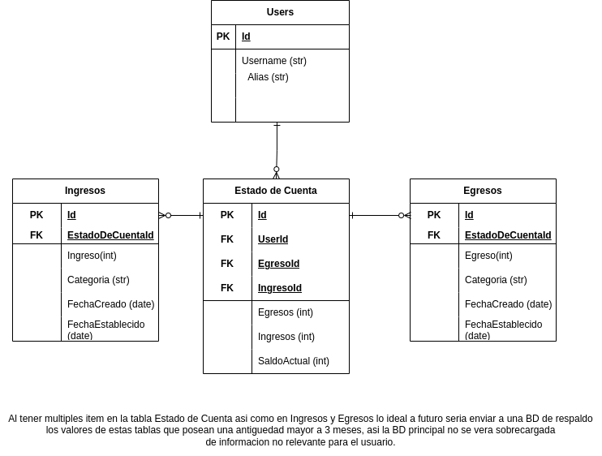

# Financial Web Application

This project is a Financial Web Application where you can register your incomes and outcomes, keeping a record of them. For now the application is under development. 

Is very important to run the migrations if you download the repo, you can use:

```python
python manage.py makemigrations
```

In addition, here you can see the db design for the models:



## Setting up

To run the app first you must install the requirements using:

```bash
$ pip install -r requirements.txt
```

The app is still in development so you may want to make migrations for the DB, you can use:

```bash
$ python3 manage.py makemigrations
$ python3 manage.py migrate
```
