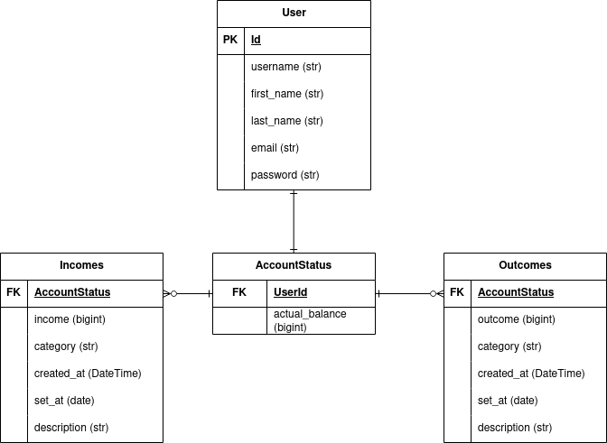

# Financhef Web Application

- [Financhef Web Application](#financhef-web-application)
  - [General use](#general-use)
  - [Database Model](#database-model)
  - [Setting Up](#setting-up)
  - [Commands](#commands)

This project is a Financial Web Application where you can register your incomes and outcomes, keeping a record of them. For now the application is under development.

## General use

Don't forget to run the migrations before using the app, you can follow the steps from [Setting up](#setting-up) section.

Furthermore, you must run the app using:

```bash
$ python3 manage.py runserver
```

After that you're ready to use the app!.

Right now the web application is on development but we launched the first version! (this version is located in main branch), it has many features but here you can look the most relevants:

- Register, edit and delete new incomes/outcomes.
- Dashboard section, including stats about your incomes/outcomes.
- Dark mode! always come in handy :D.
- Financial news.

## Database Model

This is the E-R database model diagram used along the project:



## Setting Up

To run the app first you must install the requirements using:

```bash
$ pip install -r requirements.txt
```

The app is still in development so you may want to make migrations for the DB, you can use:

```bash
$ python3 manage.py makemigrations
$ python3 manage.py migrate
```

After that process you can run the app using the command:

```bash
$ python3 manage.py runserver
```

## Commands

We created some commands for automatization, here you can see a list of them:

* `set_up_dummy_data`: This command populates the database for the main app with dummy data using factory-boy. Be careful, executing this command will delete all the old data, including superusers, so you may want to create a superuser after executing this command. Ex. of execution:

    ```bash
    $ python3 manage.py set_up_dummy_data
    ```
